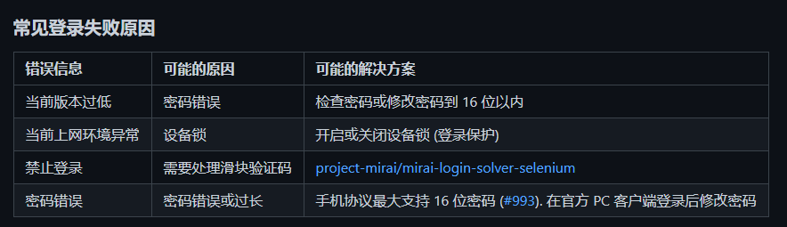

# Setubot
## 功能
- QQ群随机涩图（每天300次，另请珍惜账号，少使用R18）
## 准备
- ~~windows idea平台~~  
~~修改A_Setubot_Data中config.json的信息，每个冒号右边是对应左边的值，有说明。~~
- ~~linux平台（window使用cmd同）~~  
~~使用打包好的文件，内附说明~~  
  下载telegram，获取APIkey后运行，apikey可在运行后再设置，暂时不支持多apikey。其他内容根据提示即可
## 使用方法
help指令查看  
运行开始时会提示资源文件的位置，也可以手动修改资源文件

## 登录失败？请参考
- 修改myDeviceInfo.json,前往https://ryoii.github.io/mirai-devicejs-generator/，填写相关信息（不知道的就空着），点击generate，用下载的文件中的内容替换掉myDeviceInfo.json的内容
- 参考下图  
  
- 更换账号
  
## 本机器人依赖于mirai->https://github.com/mamoe/mirai 和loliconAPI->https://api.lolicon.app/#/setu?id=apikey  
